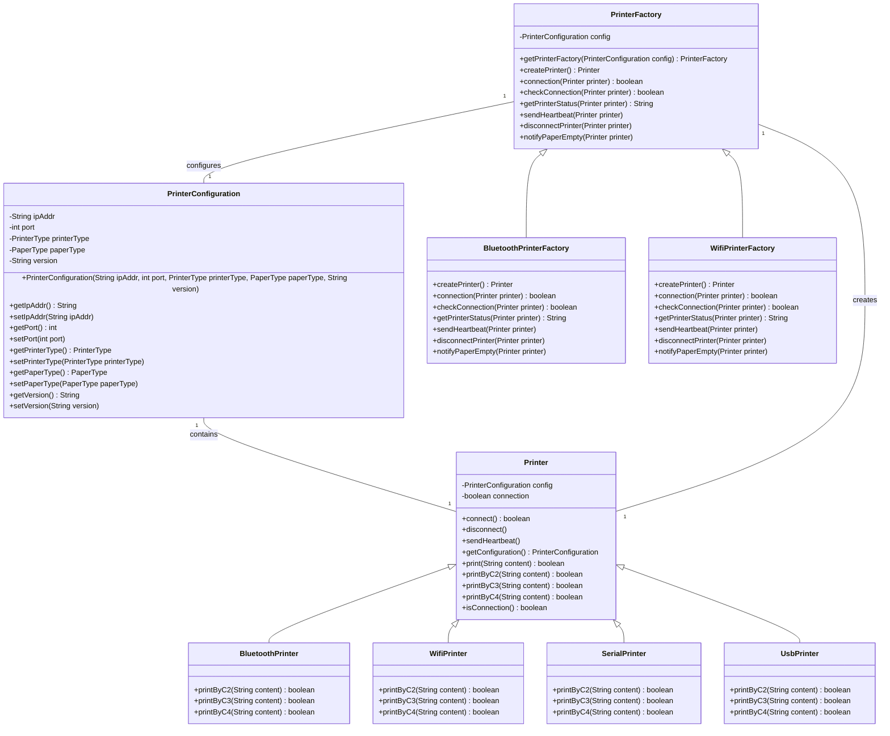

# PKU JAVA The Quize

---

### 项目结构
---
```
 src
    │   ├── main
    │   │   └── java
    │   │       └── com
    │   │           └── printer
    │   │               ├── App.java // 程序入口
    │   │               ├── config
    │   │               │   ├── PaperType.java // 枚举类，定义纸张类型
    │   │               │   ├── PrinterConfiguration.java // 打印机配置类
    │   │               │   └── PrinterType.java // 枚举类，定义打印机类型
    │   │               ├── core
    │   │               │   ├── Printer.java // 打印机功能抽象类
    │   │               │   └── impl
    │   │               │       ├── BluetoothPrinter.java // 蓝牙打印机
    │   │               │       ├── SerialPrinter.java // 串口打印机
    │   │               │       ├── UsbPrinter.java // USB打印机
    │   │               │       └── WifiPrinter.java // Wifi打印机
    │   │               ├── factory
    │   │               │   ├── PrinterFactory.java // 打印机工厂类
    │   │               │   └── impl
    │   │               │       ├── BluetoothPrinterFactory.java // 蓝牙打印机工厂
    │   │               │       └── WifiPrinterFactory.java // Wifi打印机工厂
  ```

### 实现思路概述

##### 实现策略

- 灵活性：通过使用工厂模式，项目可以轻松地引入新类型设备打印策略，而无需修改现有代码，这使得应用程序更加灵活。
- 扩展性：添加新类型或打印方式变得方便直观，有利于应用程序的横向扩展。
- 解耦：创建对象的过程从使用对象的过程中被分离出来，降低了系统各部分之间的依赖关系，提高了系统的稳定性


##### 程序关系

App类：程序入口，负责初始化应用程序和启动打印。
配置类（config）：可能包含了配置信息
核心类（core）：实现打印机的业务逻辑
工厂类（factory）：根据配置动态地创建并返回特定类型的打印机对象。继承PrintFactory公共的抽象类，保证实现统一。


### 类图


